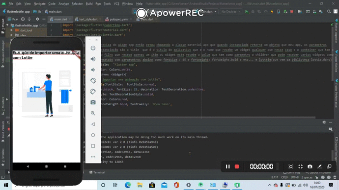

# Lottie-com-fluuter
exemplo de utilização da biblioteca lottie usando no flutter, Lottie bibliotecas de animação em flutter , onde você pode utilizar anmações feitas no afcter efects na web , no flutter ou react native , android ou ios, xamarin, windows , vue js, react etc..
acesse o site deles : https://lottiefiles.com/ 

1-passo é instalar a dependencia do projeto colocando no arquivo pubspec.yaml file o a a depedência em dependencies exemplo 
dependencies:
lottie: ^0.4.1
2.depois e so dar um flutter pub get para atualizar
3. e main.dart so colocar o caminho import 'package:lottie/lottie.dart'; como no gif acima caso queira mais detalhes acesse https://pub.dev/packages/lottie

caso isso te ajudou de uma estrelinha nesse repositorio muito obrigado !!!, feito com carinho por < h1>Keven Escovedo</h1>
